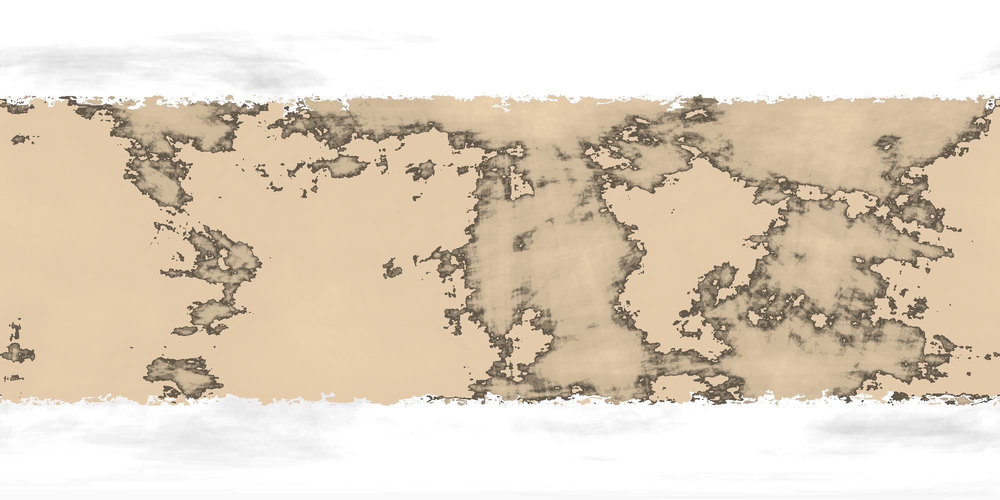

# No Rest for the Wicked
#### A Story from the Forty-First Millenium

Long is the arm of the Law of the Imperium, and harsh is its Justice. When a man crosses it, he is usually given three choices: 
immediate execution, service in the penal legions, or conversion to a servitor. But for those who are wary and can hear the footfalls 
of approaching justice from afar, there is a fourth option -- run.

While few in comparison to the trillion strong throng of mankind, many still manage to do just this, grabbing what belongings they can, 
boarding the first smuggler, mutineer, or even xenos vessel in sight, and vanishing into the darkness of space. Here, mingling in the 
outer murk with pirates, mutants, savages, xenos, and the deadliest opponent -- the void itself -- many perish. But in the far periphery, 
amidst the dim light of the heathen stars, some have found a new home -- Pilgrim's Dusk.

In this system, bound to a single small, rocky planet in an eccentric orbit about a dying star, the fugitives of the Imperium have forged 
a rugged society of the disgraced, the betrayed, and... others... into a republic of sorts. With few visitors (and none more wanted), the 
people of Pilgrim's Dusk work to eek out an existence from the land in brief summer months, before bracing to endure the long, 
harsh winter.

It is in one such winter, in one remote town, far beneath the thick blizzards and biting cold, that our story begins, as three strangers
meet, and put in motion events that will echo deep through the empty tomb of space.

## Pilgrim's Dusk
### History

### Geography

## The Brethren of the Reach

